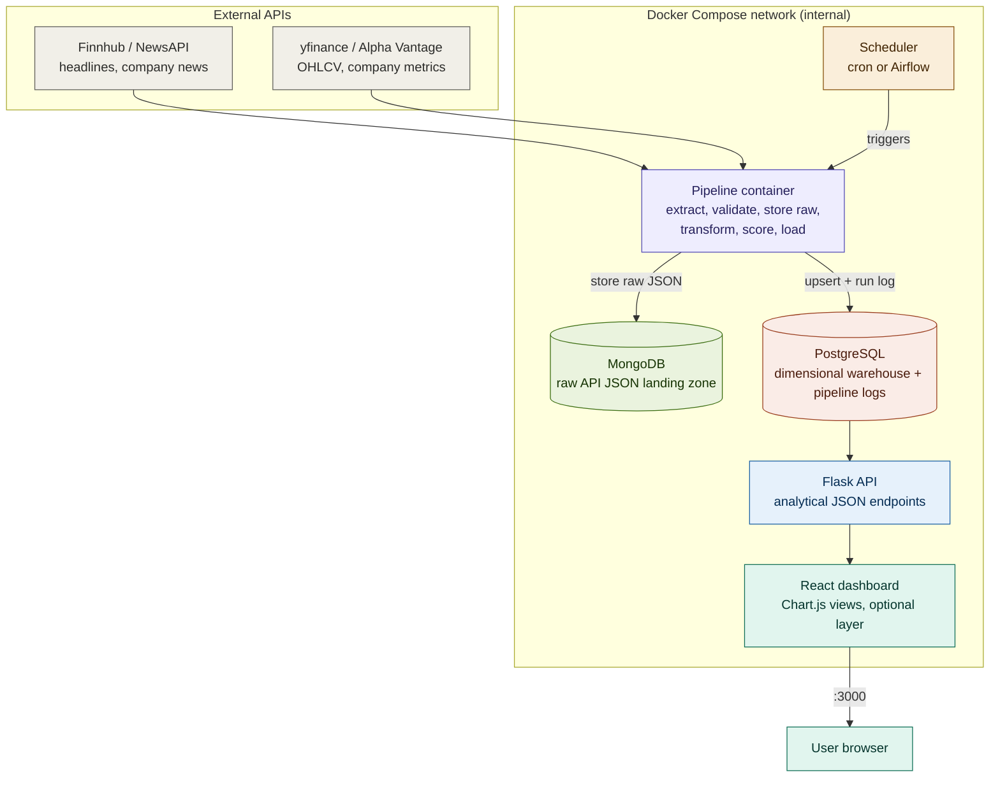
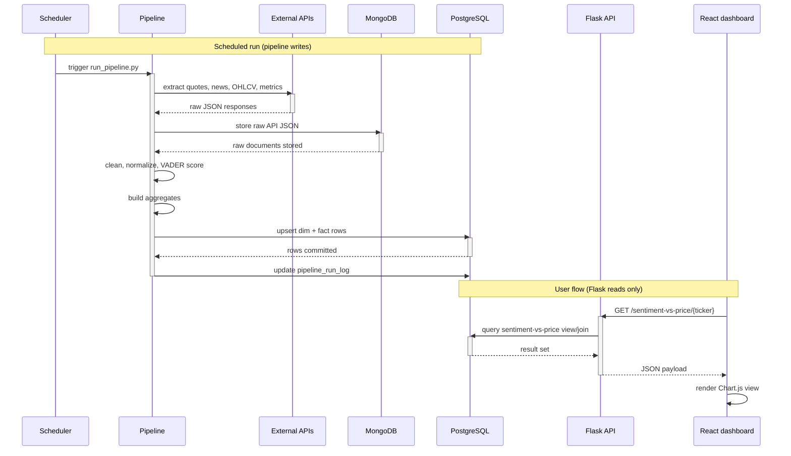

# MarketPulse — Mermaid Diagrams (v2)

Updated per the project handoff: MongoDB is now a required raw landing zone,
PostgreSQL has 9 tables (3 dims + 5 facts + run log), the pipeline label
reflects the full lifecycle, and the React dashboard is labeled optional.

Paste either block into https://mermaid.live to render/export, or use fenced
```mermaid blocks in Markdown that supports Mermaid (GitHub, GitLab, VS Code).

---

## 1. System Architecture



Notes:
- The `subgraph COMPOSE` boundary is the security boundary: everything inside
  is on the internal Docker network. Only the frontend port (`:3000`) crosses
  out to the user. Postgres and Mongo publish no host port.
- MongoDB is now solid (required MVP), not dashed — it stores raw API JSON
  before transformation, giving the project both NoSQL and relational storage.
- The dashboard connects only to the Flask API — never to Postgres or the
  external APIs directly.
- Responsibility split: the pipeline writes raw data to Mongo and cleaned data
  to Postgres; the Flask API only reads from Postgres in the MVP (no writes);
  the React dashboard only consumes API responses.
- `[(...)]` is Mermaid's cylinder (database) shape.

---

## 2. Sequence Diagram



Notes:
- `->>` is a solid (synchronous) call; `-->>` is a dashed return.
- MongoDB now appears as a participant: the pipeline stores raw JSON before
  transforming, and writes a final `pipeline_run_log` update after loading.
- The visual gap between `UI` and `DB`/`API`(external) is intentional — the
  dashboard only ever talks to Flask, which protects rate-limited APIs from
  dashboard traffic.
