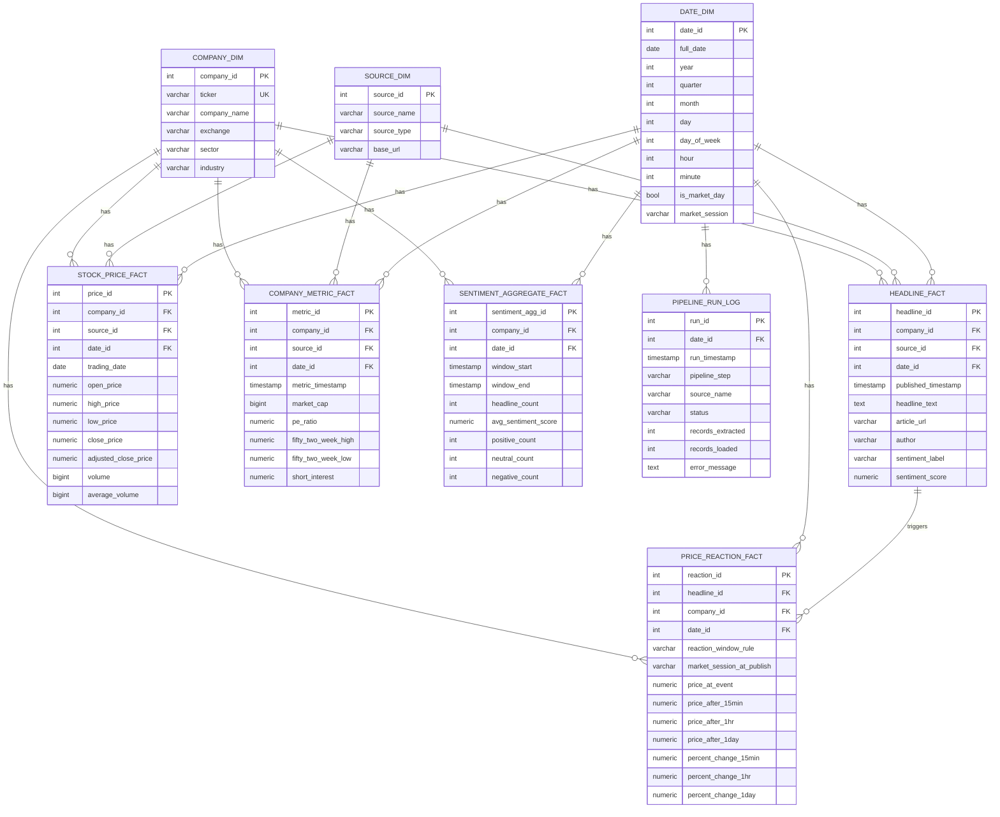

# MarketPulse ERD — Mermaid Source

Star schema: three shared dimensions (company, date, source) at the center,
five fact tables radiating out, plus an operational run-log table. The single
fact-to-fact link (headline → price reaction) is what lets you ask "did this
specific headline move the price?".

Paste into https://mermaid.live to render/export, or use a ```mermaid fenced
block in Markdown that supports it (GitHub, VS Code with a Mermaid extension).

Readability notes:
- Entities are declared dimensions-first, then facts, so related tables sit
  near each other and Mermaid routes shorter, straighter connectors.
- Relationship labels are kept to one short word to avoid label collisions.
- If you want even cleaner output for the PDF deliverable, paste this into
  Draw.io or Lucidchart — those give manual control over connector routing
  that Mermaid's auto-layout can't match.



## Why star, not snowflake

- Facts join directly to dimensions — no dimension is normalized into
  sub-tables, so queries like /sentiment-vs-price need fewer joins.
- Dimensions are small (companies, sources, dates), so the redundancy a star
  tolerates costs almost nothing here.
- SOURCE_DIM intentionally connects only to the three vendor-sourced facts
  (headline, stock price, company metric). SENTIMENT_AGGREGATE_FACT and
  PRICE_REACTION_FACT are computed by the pipeline, so they have no source FK.
- PIPELINE_RUN_LOG keeps a free-text source_name (not a source_id FK) because
  it is a write-once operational log that may reference a source before a dim
  row exists.
```
